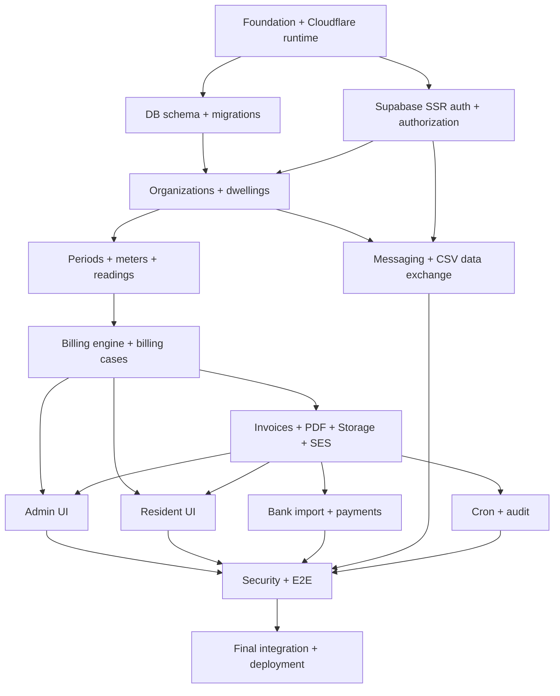

# Property Billing Platform — Orca ADE Developer Specification

**Document ID:** PBILL-ORCA-ASTRO-001  
**Version:** 2.0  
**Date:** 2026-09-10  
**Status:** Build contract / source of truth  
**Reference product:** B118 public guide (`https://b118.lv/docs`)  
**Target:** Small production SaaS, initially up to ~1,000 users  
**Primary roles:** `ADMIN`, `RESIDENT`

---

# 0. Instruction to Orca, Antigravity, Claude and OpenAI agents

This document is the authoritative product and engineering specification for v1.

Agents MUST:

1. Read this entire file before implementing.
2. Inspect the existing repository before scaffolding or replacing anything.
3. Preserve exactly two end-user access levels: `ADMIN` and `RESIDENT`.
4. Enforce all permissions server-side.
5. Scope every organization-owned query by authorized `organization_id`.
6. Scope every resident-owned query by authorized `dwelling_id`.
7. Use PostgreSQL exact numeric/decimal values for money and meter readings.
8. Treat a sent invoice as an immutable financial record.
9. Create migrations, tests, seed data and error states as part of each feature.
10. Avoid inventing major functionality not in this specification.
11. Record material architectural deviations as ADRs in `docs/decisions/`.
12. Never declare a task complete solely because a page renders.
13. Run relevant quality gates before reporting `worker_done`.
14. Prefer simple, maintainable code over speculative abstractions.

The product's core loop is:

**collect data → calculate → verify → deliver → reconcile → preserve history**

---

# 1. Product definition

Build a multi-tenant property billing web application for apartment buildings, housing associations, cooperatives and small property managers.

The administrator manages:

- organizations/buildings;
- dwellings/units;
- residents and access assignments;
- monthly billing periods;
- meters and readings;
- recurring billing rules/tariffs;
- invoice generation and review;
- invoice PDF generation;
- invoice email delivery;
- invoice status;
- bank CSV import;
- payment reconciliation;
- resident communication;
- CSV import/export;
- organization/admin settings;
- audit history;
- optional automatic invoice generation/sending.

The resident can:

- access only dwellings explicitly assigned to them;
- view current and historical invoices;
- view/download/print invoice PDFs;
- inspect invoice calculation lines;
- see consumption history;
- submit missing readings while permitted;
- send messages to the administrator.

Canonical hierarchy:

```text
Organization
  └── Dwelling
       ├── Resident access
       ├── Meters
       └── Billing Case per Period
              ├── Readings
              └── Invoice
                    ├── Invoice lines
                    ├── PDF
                    ├── Deliveries
                    └── Payment match
```

The public B118 guide confirms the reference workflow of organization → objects → monthly periods → readings → invoice preparation → sending → bank CSV reconciliation, as well as owner-only object access and owner-submitted water readings.

---

# 2. Scope

## 2.1 v1 goals

The application is complete when a seeded organization can execute a full monthly billing cycle:

1. create/select a billing period;
2. collect missing readings;
3. calculate invoice lines;
4. generate invoices;
5. prepare invoices;
6. generate canonical PDF;
7. email invoices;
8. resident opens own invoice;
9. admin imports bank CSV;
10. system proposes exact matches;
11. admin confirms payment;
12. invoice becomes paid;
13. history remains reproducible and auditable.

## 2.2 non-goals

Do NOT implement in v1:

- native mobile applications;
- online card payments;
- open banking;
- automated bank sync;
- IoT meter integration;
- OCR meter photos;
- maintenance/work orders;
- building access control;
- ERP/accounting integrations;
- partial payment allocation;
- refunds/credit notes;
- debt collection;
- complex late-fee engines;
- arbitrary workflow builders;
- drag-and-drop invoice layout builder;
- separate owner/tenant/landlord roles;
- a third customer role;
- structured Latvian B2B e-invoice transport.

Keep future B2B structured invoicing possible without implementing it now.

---

# 3. Locked technology architecture

Do not substitute another framework or primary database without an ADR and explicit coordinator approval.

## 3.1 application

- **Astro**, current stable release compatible with Cloudflare adapter
- **SSR / `output: "server"`**
- **TypeScript**, `strict: true`
- **Tailwind CSS 4**
- **React islands** only where client interaction materially benefits from React
- **shadcn/ui** / Radix-derived accessible primitives where useful
- **Astro Actions** for internal typed mutations
- Astro API endpoints only for public callbacks, file/token access, webhooks and external-style endpoints

Principle:

```text
Astro = application framework
React = optional interactive island layer
```

Do not turn the application into a full React SPA.

## 3.2 persistence

- **PostgreSQL**
- **Supabase hosted Postgres**
- exact Supabase region: **Central EU (Frankfurt / eu-central-1)**
- **Drizzle ORM**
- **Drizzle Kit migrations**
- **node-postgres (`pg`)**
- Cloudflare **Hyperdrive** between Worker and production Postgres

Local development may connect directly to PostgreSQL/Supabase using `DATABASE_URL`.
Production application traffic must use Hyperdrive.

## 3.3 authentication

- **Supabase Auth**
- **`@supabase/ssr`** for cookie-based SSR sessions
- PKCE-compatible server flow
- resident: email magic link
- admin: password/passkey-capable login plus MFA
- authorization remains application-owned

Supabase authenticates identity. Our database decides authorization.

## 3.4 files and invoices

- **Supabase Storage**
- private `invoices` bucket
- no public invoice object URLs
- canonical invoice PDF stored after generation
- PDF generation via **Cloudflare Browser Run `/pdf`** from controlled invoice HTML
- store SHA-256 hash of canonical PDF

## 3.5 runtime/deployment

- **Cloudflare Workers**
- NOT Cloudflare Pages
- Astro official Cloudflare adapter
- Cloudflare Cron Triggers for scheduled work
- Cloudflare Browser Run for invoice PDF
- Hyperdrive for Postgres
- production environment uses Worker bindings/secrets

## 3.6 email

Default production provider:

- **Amazon SES, eu-central-1 (Frankfurt)**

Wrap email behind an internal adapter:

```ts
interface EmailService {
  sendInvoice(input: SendInvoiceEmailInput): Promise<EmailDeliveryResult>;
  sendMagicLink?(input: MagicLinkEmailInput): Promise<EmailDeliveryResult>;
}
```

Supabase Auth may use configured SMTP for auth emails. Application invoice mail should use the app email abstraction.

## 3.7 validation/testing

- `astro/zod` or compatible Zod through Astro Actions
- Vitest
- Playwright
- ESLint where supported by repository configuration
- Prettier
- TypeScript typecheck
- Astro check

---

# 4. Deployment topology

```text
                           User browser
                                │
                                ▼
                       Cloudflare network
                                │
                                ▼
                  ┌────────────────────────┐
                  │ Astro SSR Worker       │
                  │                        │
                  │ pages                  │
                  │ middleware             │
                  │ Astro Actions          │
                  │ API endpoints          │
                  │ auth authorization     │
                  │ billing domain         │
                  └──────┬─────┬─────┬────┘
                         │     │     │
                 ┌───────┘     │     └─────────────┐
                 ▼             ▼                   ▼
           Hyperdrive      Supabase Auth      Browser Run
                 │                                  │
                 ▼                                  ▼
        Supabase PostgreSQL                    Invoice PDF
        Frankfurt / EU                             │
                 │                                 ▼
                 │                         Supabase Storage
                 │                           private bucket
                 │
                 └───────────────┐
                                 ▼
                             Audit data

Cloudflare Cron
      │
      ├── overdue scan
      ├── auto generation
      └── auto sending

Astro Worker
      │
      └── Amazon SES Frankfurt
             └── invoice email
```

For ~1,000 users, do not add Kubernetes, a dedicated API server, Redis, Kafka or a separate frontend deployment.

---

# 5. Framework configuration

Use the official Cloudflare Astro adapter.

Representative configuration:

```ts
// astro.config.ts
import { defineConfig } from "astro/config";
import cloudflare from "@astrojs/cloudflare";
import react from "@astrojs/react";
import tailwindcss from "@tailwindcss/vite";

export default defineConfig({
  output: "server",
  adapter: cloudflare(),
  integrations: [react()],
  vite: {
    plugins: [tailwindcss()],
  },
});
```

If current Astro/Tailwind integration differs, use the current official Astro setup rather than forcing stale syntax.

Cloudflare runtime must be tested with:

```bash
astro build
astro preview
```

Do not rely only on the Node-based Astro dev server for production compatibility.

---

# 6. Cloudflare configuration

Representative `wrangler.jsonc`:

```jsonc
{
  "name": "property-billing",
  "compatibility_date": "2026-09-10",

  "hyperdrive": [
    {
      "binding": "HYPERDRIVE",
      "id": "<production-hyperdrive-id>"
    }
  ],

  "triggers": {
    "crons": ["15 2 * * *"]
  }
}
```

Use current Wrangler schema if this changes.

Secrets MUST use Cloudflare secrets/environment configuration, never committed JSON:

```text
SUPABASE_URL
SUPABASE_PUBLISHABLE_KEY
SUPABASE_SECRET_KEY          # server only
AWS_SES_ACCESS_KEY_ID
AWS_SES_SECRET_ACCESS_KEY
AWS_SES_REGION
EMAIL_FROM
APP_BASE_URL
INVOICE_TOKEN_SECRET
```

Local-only:

```text
DATABASE_URL
```

The Supabase service/secret key is server-only and must never be prefixed `PUBLIC_`.

---

# 7. Repository layout

```text
/
├── src/
│   ├── actions/
│   │   ├── index.ts
│   │   ├── organizations.ts
│   │   ├── dwellings.ts
│   │   ├── periods.ts
│   │   ├── meters.ts
│   │   ├── readings.ts
│   │   ├── billing.ts
│   │   ├── invoices.ts
│   │   ├── payments.ts
│   │   └── messages.ts
│   │
│   ├── components/
│   │   ├── ui/
│   │   ├── admin/
│   │   ├── resident/
│   │   ├── billing/
│   │   └── invoices/
│   │
│   ├── db/
│   │   ├── client.ts
│   │   ├── schema/
│   │   │   ├── auth.ts
│   │   │   ├── organizations.ts
│   │   │   ├── dwellings.ts
│   │   │   ├── billing.ts
│   │   │   ├── invoices.ts
│   │   │   ├── payments.ts
│   │   │   ├── messaging.ts
│   │   │   └── audit.ts
│   │   └── queries/
│   │
│   ├── domain/
│   │   ├── auth/
│   │   ├── authorization/
│   │   ├── organizations/
│   │   ├── readings/
│   │   ├── billing/
│   │   ├── invoices/
│   │   ├── payments/
│   │   └── messaging/
│   │
│   ├── layouts/
│   │   ├── AdminLayout.astro
│   │   ├── ResidentLayout.astro
│   │   └── AuthLayout.astro
│   │
│   ├── lib/
│   │   ├── supabase/
│   │   ├── email/
│   │   ├── storage/
│   │   ├── pdf/
│   │   ├── decimal/
│   │   └── logging/
│   │
│   ├── middleware.ts
│   │
│   ├── pages/
│   │   ├── index.astro
│   │   ├── login.astro
│   │   ├── auth/
│   │   │   └── confirm.ts
│   │   ├── invoice/
│   │   │   └── access/
│   │   │       └── [token].ts
│   │   ├── admin/
│   │   ├── portal/
│   │   └── api/
│   │       └── v1/
│   │
│   └── styles/
│       └── global.css
│
├── drizzle/
│   └── migrations/
├── tests/
│   ├── unit/
│   ├── integration/
│   └── e2e/
├── fixtures/
│   ├── bank/
│   └── imports/
├── docs/
│   ├── product/
│   ├── decisions/
│   └── deployment/
├── scripts/
├── astro.config.ts
├── drizzle.config.ts
├── wrangler.jsonc
├── tsconfig.json
├── package.json
└── .env.example
```

Business rules belong in `src/domain/`, not Astro pages or React components.

Astro Actions call the domain layer. The domain layer calls scoped repositories.

---

# 8. Roles and permission model

```ts
type UserRole = "ADMIN" | "RESIDENT";
```

## ADMIN

Admin receives organization access through:

```text
organization_memberships
```

An admin may belong to multiple organizations.

## RESIDENT

Resident receives dwelling access through:

```text
dwelling_access
```

A resident may access one or more dwellings.

No resident automatically receives organization-wide access.

## Authorization invariant

Every protected request/action:

```text
Supabase authenticated identity
        ↓
app_users record
        ↓
role
        ↓
membership/access lookup
        ↓
target resource tenant/dwelling
        ↓
allowed action
```

Admin:

```text
target.organization_id
∈ currentUser.organizationMemberships
```

Resident:

```text
target.dwelling_id
∈ currentUser.dwellingAccess
```

Never authorize by matching email strings alone.

---

# 9. Exact routes

## 9.1 public/auth

| Route | Purpose |
|---|---|
| `/` | product landing or login redirect |
| `/login` | login entry |
| `/auth/confirm` | Supabase OTP/magic-link confirmation |
| `/invoice/access/[token]` | tokenized invoice access |
| `/unauthorized` | access denied |
| `/logout` | logout action/redirect |

## 9.2 admin

| Route | Purpose |
|---|---|
| `/admin` | organization redirect/selector |
| `/admin/organizations` | organization selector/create |
| `/admin/o/[orgId]/dashboard` | current period dashboard |
| `/admin/o/[orgId]/periods` | period history |
| `/admin/o/[orgId]/periods/[periodId]` | monthly billing workbench |
| `/admin/o/[orgId]/periods/[periodId]/invoices/[invoiceId]` | invoice detail |
| `/admin/o/[orgId]/dwellings` | dwelling list/import |
| `/admin/o/[orgId]/dwellings/[dwellingId]` | dwelling detail |
| `/admin/o/[orgId]/payments` | reconciliation dashboard |
| `/admin/o/[orgId]/payments/imports/[importId]` | bank import detail |
| `/admin/o/[orgId]/messages` | conversation list |
| `/admin/o/[orgId]/messages/[conversationId]` | conversation |
| `/admin/o/[orgId]/settings` | settings index |
| `/admin/o/[orgId]/settings/organization` | legal/bank/contact |
| `/admin/o/[orgId]/settings/billing` | billing automation |
| `/admin/o/[orgId]/settings/rules` | tariffs/rules |
| `/admin/o/[orgId]/settings/invoice-template` | invoice appearance |
| `/admin/o/[orgId]/settings/users` | admin + resident access |
| `/admin/o/[orgId]/settings/data` | import/export |
| `/admin/o/[orgId]/audit` | audit history |

## 9.3 resident

| Route | Purpose |
|---|---|
| `/portal` | dwelling redirect/selector |
| `/portal/dwellings` | assigned dwellings |
| `/portal/dwellings/[dwellingId]` | resident dashboard |
| `/portal/dwellings/[dwellingId]/invoices` | invoice history |
| `/portal/invoices/[invoiceId]` | invoice detail |
| `/portal/dwellings/[dwellingId]/messages` | conversations |
| `/portal/profile` | profile/session |

Every route performs independent server authorization.

---

# 10. Astro Action contract

Internal product mutations should use Astro Actions.

`src/actions/index.ts` composes domain action groups:

```ts
export const server = {
  organizations,
  dwellings,
  periods,
  meters,
  readings,
  billing,
  invoices,
  payments,
  messages,
};
```

Examples:

```text
organizations.create
organizations.update

dwellings.create
dwellings.update
dwellings.archive
dwellings.assignResident
dwellings.removeResident

periods.create
periods.lock

meters.create
meters.update
meters.archive

readings.submitAdmin
readings.submitResident

billingRules.create
billingRules.update
billingRules.archive

invoices.generate
invoices.generateBulk
invoices.prepare
invoices.send
invoices.resend
invoices.overrideStatus

payments.importCsv
payments.confirmMatch
payments.rejectMatch

messages.createConversation
messages.reply
messages.resolve
```

Each action MUST:

1. validate input;
2. authenticate;
3. authorize;
4. call domain service;
5. execute mutation transactionally where required;
6. emit audit record where specified;
7. return typed result/error.

Astro Actions are network-accessible server endpoints. Never trust the client because an action is "internal".

---

# 11. Public/API endpoints

Use `src/pages/api/v1` only where URL-style endpoints are materially appropriate.

Required:

```text
POST /api/v1/auth/request-link
GET  /auth/confirm

GET  /invoice/access/:token

GET  /api/v1/admin/o/:orgId/invoices/:invoiceId/pdf
GET  /api/v1/portal/invoices/:invoiceId/pdf

GET  /api/v1/admin/o/:orgId/dwellings/export
GET  /api/v1/admin/o/:orgId/readings/export
```

Future webhooks belong under:

```text
/api/v1/webhooks/*
```

Error structure:

```json
{
  "error": {
    "code": "FORBIDDEN",
    "message": "You do not have access to this resource.",
    "requestId": "req_xxx",
    "fieldErrors": null
  }
}
```

Do not expose whether a foreign tenant resource exists.

---

# 12. Database identity model

Supabase owns:

```text
auth.users
```

Application owns:

```text
app_users
```

`app_users.id` must equal the corresponding Supabase `auth.users.id`.

Recommended application table:

```text
app_users
- id uuid PK
- role enum ADMIN|RESIDENT NOT NULL
- email_snapshot text NOT NULL
- display_name text NULL
- disabled_at timestamptz NULL
- created_at
- updated_at
```

Do not use `email_snapshot` as an authorization key.

When auth email changes, synchronize the snapshot.

---

# 13. Database schema

This section is normative.

## 13.1 enums

```text
user_role
  ADMIN
  RESIDENT

dwelling_type
  APARTMENT
  COMMERCIAL_UNIT
  PARKING
  STORAGE
  OTHER

meter_type
  COLD_WATER
  HOT_WATER
  ELECTRICITY
  GAS
  HEAT
  OTHER

period_status
  OPEN
  LOCKED

reading_source
  ADMIN
  RESIDENT
  IMPORT

billing_case_status
  MISSING_DATA
  DRAFT
  PREPARED
  SENT
  PAID
  OVERDUE

billing_calculation_type
  FIXED
  AREA
  RESIDENT_COUNT
  METER_CONSUMPTION
  MANUAL_QUANTITY
  MANUAL_AMOUNT

conversation_status
  NEW
  OPEN
  RESOLVED

payment_match_status
  PROPOSED
  CONFIRMED
  REJECTED

payment_match_type
  AUTO_EXACT
  AUTO_PROBABLE
  MANUAL
```

## 13.2 organizations

```text
organizations
- id uuid PK
- name text NOT NULL
- registration_number text NULL
- vat_number text NULL
- address_line1 text NOT NULL
- address_line2 text NULL
- city text NULL
- postal_code text NULL
- country_code char(2) NOT NULL DEFAULT 'LV'
- email text NULL
- phone text NULL
- bank_name text NULL
- iban text NULL
- bic text NULL
- currency char(3) NOT NULL DEFAULT 'EUR'
- timezone text NOT NULL DEFAULT 'Europe/Riga'
- locale text NOT NULL DEFAULT 'lv'
- invoice_prefix text NOT NULL DEFAULT 'INV'
- default_due_days integer NOT NULL DEFAULT 14
- auto_generate_enabled boolean DEFAULT false
- auto_send_enabled boolean DEFAULT false
- auto_send_day smallint NULL
- created_at timestamptz
- updated_at timestamptz
- archived_at timestamptz NULL
```

Constraints:
- `default_due_days` 0..120
- `auto_send_day` 1..28 when present

## 13.3 organization_memberships

```text
organization_memberships
- organization_id uuid FK
- user_id uuid FK app_users
- created_at
PRIMARY KEY (organization_id, user_id)
```

Only `ADMIN` users may have active organization membership.

## 13.4 dwellings

```text
dwellings
- id uuid PK
- organization_id uuid FK NOT NULL
- type dwelling_type NOT NULL DEFAULT APARTMENT
- number text NOT NULL
- display_name text NULL
- occupant_name text NULL
- billing_name text NULL
- billing_email text NULL
- billing_address text NULL
- area_m2 numeric(10,2) NOT NULL DEFAULT 0
- resident_count integer NOT NULL DEFAULT 0
- notes text NULL
- created_at
- updated_at
- archived_at NULL
UNIQUE (organization_id, number)
```

## 13.5 dwelling_access

```text
dwelling_access
- dwelling_id uuid FK
- user_id uuid FK app_users
- created_at
PRIMARY KEY (dwelling_id, user_id)
```

Only `RESIDENT` users may normally be assigned.

## 13.6 meters

```text
meters
- id uuid PK
- organization_id uuid FK
- dwelling_id uuid FK
- type meter_type
- serial_number text NULL
- unit text NOT NULL
- label text NULL
- installed_at date NULL
- archived_at timestamptz NULL
- created_at
```

`organization_id` must equal the dwelling organization.

## 13.7 billing_periods

```text
billing_periods
- id uuid PK
- organization_id uuid FK
- year integer
- month smallint
- starts_on date
- ends_on date
- reading_deadline date NULL
- invoice_issue_date date
- invoice_due_date date
- status OPEN|LOCKED
- locked_at timestamptz NULL
- created_at
UNIQUE (organization_id, year, month)
```

## 13.8 meter_readings

```text
meter_readings
- id uuid PK
- organization_id uuid FK
- period_id uuid FK
- meter_id uuid FK
- previous_value numeric(14,3) NULL
- current_value numeric(14,3) NOT NULL
- consumption numeric(14,3) NOT NULL
- source reading_source
- submitted_by_user_id uuid NULL
- submitted_at timestamptz
- note text NULL
UNIQUE (period_id, meter_id)
```

## 13.9 billing_rules

```text
billing_rules
- id uuid PK
- organization_id uuid FK
- name text
- code text
- description text NULL
- calculation_type enum
- meter_type enum NULL
- unit text
- unit_price numeric(14,4) NULL
- vat_rate numeric(7,4) DEFAULT 0
- effective_from date
- effective_until date NULL
- sort_order integer DEFAULT 0
- enabled boolean DEFAULT true
- created_at
- updated_at
- archived_at NULL
UNIQUE (organization_id, code)
```

## 13.10 billing_cases

`billing_case` owns the monthly workflow status.

```text
billing_cases
- id uuid PK
- organization_id uuid FK
- period_id uuid FK
- dwelling_id uuid FK
- status billing_case_status DEFAULT MISSING_DATA
- missing_data jsonb DEFAULT []
- manual_status_override boolean DEFAULT false
- status_updated_at timestamptz
- created_at
UNIQUE (period_id, dwelling_id)
```

Do not put `MISSING_DATA` solely on invoices because an invoice does not yet exist.

## 13.11 invoices

```text
invoices
- id uuid PK
- organization_id uuid FK
- billing_case_id uuid FK UNIQUE
- dwelling_id uuid FK
- period_id uuid FK
- invoice_number text NOT NULL
- issue_date date
- due_date date
- currency char(3)
- subtotal numeric(14,2)
- vat_total numeric(14,2)
- total numeric(14,2)
- issuer_snapshot jsonb
- recipient_snapshot jsonb
- payment_snapshot jsonb
- template_snapshot jsonb
- version integer DEFAULT 1
- prepared_at timestamptz NULL
- sent_at timestamptz NULL
- paid_at timestamptz NULL
- pdf_object_key text NULL
- pdf_sha256 text NULL
- created_at
- updated_at
UNIQUE (organization_id, invoice_number)
```

## 13.12 invoice_lines

```text
invoice_lines
- id uuid PK
- organization_id uuid FK
- invoice_id uuid FK
- billing_rule_id uuid NULL
- sort_order integer
- description text
- calculation_type enum
- source_snapshot jsonb
- unit text NULL
- quantity numeric(14,4) NULL
- unit_price numeric(14,4) NULL
- vat_rate numeric(7,4)
- net_amount numeric(14,2)
- vat_amount numeric(14,2)
- gross_amount numeric(14,2)
```

## 13.13 invoice_access_tokens

```text
invoice_access_tokens
- id uuid PK
- organization_id uuid
- invoice_id uuid
- token_hash text UNIQUE
- expires_at timestamptz NULL
- revoked_at timestamptz NULL
- created_at
```

Raw token is never stored.

## 13.14 invoice_deliveries

```text
invoice_deliveries
- id uuid PK
- organization_id uuid
- invoice_id uuid
- destination_email text
- provider text
- provider_message_id text NULL
- status text
- error_code text NULL
- sent_at timestamptz NULL
- created_at
```

## 13.15 invoice_templates

```text
invoice_templates
- id uuid PK
- organization_id uuid UNIQUE
- logo_object_key text NULL
- header_text text NULL
- footer_text text NULL
- payment_instructions text NULL
- default_note text NULL
- config jsonb DEFAULT {}
- updated_at
```

## 13.16 bank_imports

```text
bank_imports
- id uuid PK
- organization_id uuid
- original_filename text
- file_sha256 text
- imported_by_user_id uuid
- imported_at
- row_count integer
UNIQUE (organization_id, file_sha256)
```

## 13.17 bank_transactions

```text
bank_transactions
- id uuid PK
- organization_id uuid
- bank_import_id uuid
- external_transaction_id text NULL
- booking_date date
- amount numeric(14,2)
- currency char(3)
- payer_name text NULL
- payer_account text NULL
- reference text NULL
- raw_data jsonb
- row_number integer
```

## 13.18 payment_matches

```text
payment_matches
- id uuid PK
- organization_id uuid
- bank_transaction_id uuid
- invoice_id uuid
- match_type enum
- status enum DEFAULT PROPOSED
- confidence numeric(5,4) NULL
- confirmed_by_user_id uuid NULL
- confirmed_at timestamptz NULL
- created_at
UNIQUE (bank_transaction_id, invoice_id)
```

## 13.19 conversations/messages

```text
conversations
- id uuid PK
- organization_id uuid
- dwelling_id uuid
- subject text
- status NEW|OPEN|RESOLVED
- created_by_user_id uuid
- created_at
- updated_at
- resolved_at NULL

messages
- id uuid PK
- organization_id uuid
- conversation_id uuid
- sender_user_id uuid
- body text
- created_at
- read_at NULL
```

## 13.20 audit_logs

```text
audit_logs
- id uuid PK
- organization_id uuid NULL
- actor_user_id uuid NULL
- action text
- entity_type text
- entity_id uuid NULL
- before_data jsonb NULL
- after_data jsonb NULL
- request_id text NULL
- ip_hash text NULL
- created_at
```

Index:
`(organization_id, created_at DESC)`

---

# 14. Database access policy

Use repositories that require tenant scope explicitly.

Bad:

```ts
getInvoice(invoiceId)
```

Preferred:

```ts
getAdminInvoice({
  organizationId,
  invoiceId,
});
```

Resident:

```ts
getResidentInvoice({
  userId,
  invoiceId,
});
```

Repository calls that retrieve organization-owned resources without a tenant/access parameter should be exceptional and private to narrowly controlled domain code.

Use database transactions for:

- invoice numbering + generation;
- invoice status changes with financial side effects;
- payment confirmation;
- import commit;
- access assignment where account provisioning is involved.

---

# 15. Authentication flows

## 15.1 resident magic link

Flow:

```text
/login
  ↓
resident enters email
  ↓
POST /api/v1/auth/request-link
  ↓
neutral 202 response
  ↓
Supabase Auth magic link
  ↓
/auth/confirm?token_hash=...&type=...
  ↓
server verifies OTP
  ↓
SSR session cookie
  ↓
/portal
```

Requirements:

- `shouldCreateUser: false` for ordinary resident login;
- resident must be provisioned by admin/access assignment first;
- neutral response for unknown/known email;
- rate-limit endpoint;
- custom auth email flow must avoid accidental consumption by link scanners where practical;
- redirect URL allow-list must be explicit;
- use PKCE/SSR-compatible verification;
- session must be available to Astro SSR.

## 15.2 admin auth

Admin uses:

```text
email + password/passkey-capable auth
        ↓
MFA
        ↓
AAL2 required for admin area
```

At production readiness, `/admin/**` requires an admin session satisfying configured MFA assurance.

If initial development temporarily permits AAL1, this must be feature-flagged and forbidden in production.

## 15.3 middleware

`src/middleware.ts` should:

- create SSR Supabase client;
- resolve authenticated identity for protected paths;
- load `app_users`;
- attach minimal typed auth context to `locals`;
- redirect anonymous requests;
- reject disabled users;
- avoid database-heavy authorization globally where route-level authorization is more precise.

Never trust a client-provided role.

---

# 16. Billing period rules

Exactly one billing period per organization/year/month.

Period creation transaction:

1. create period;
2. select every active dwelling;
3. create one billing case for each;
4. determine required readings/data;
5. set `MISSING_DATA` or generation-ready state.

`LOCKED` period blocks:

- normal reading edits;
- invoice regeneration;
- rule input edits that would mutate period outcome.

Historical viewing remains available.

---

# 17. Meter reading rules

For cumulative meter:

```text
consumption = current_value - previous_value
```

Rules:

- numeric, max 3 decimals;
- current >= 0;
- current normally >= previous;
- resident cannot submit to archived meter;
- resident can only submit for assigned dwelling;
- resident can only submit in permitted/open period;
- one reading per meter/period;
- previous reading is most recent prior accepted reading;
- lower current value needs explicit admin reset/replacement flow;
- every update audited;
- successful resident reading appears immediately in admin workbench.

Do not use JS binary floating-point for persisted calculations.

---

# 18. Billing rules

Supported v1 calculations:

## FIXED

```text
quantity = 1
```

## AREA

```text
quantity = dwelling.area_m2
```

## RESIDENT_COUNT

```text
quantity = dwelling.resident_count
```

## METER_CONSUMPTION

```text
quantity = period consumption for configured meter type
```

## MANUAL_QUANTITY

Admin supplies quantity.

## MANUAL_AMOUNT

Admin supplies amount according to defined UI semantics.

Calculation:

```text
net = ROUND(quantity × unit_price, 2)
vat = ROUND(net × vat_rate / 100, 2)
gross = net + vat
```

Use one centralized Decimal implementation and test it heavily.

---

# 19. Billing state machine

Canonical `billing_case.status`:

```text
MISSING_DATA
     │
     │ inputs complete + invoice generated
     ▼
   DRAFT
     │
     │ prepare
     ▼
 PREPARED
     │
     │ at least one successful delivery
     ▼
    SENT
   ┌─┴────────────┐
   │              │
payment       due date passes
   │              │
   ▼              ▼
 PAID          OVERDUE
                  │
               payment
                  │
                  ▼
                 PAID
```

Rules:

- `MISSING_DATA`: invoice cannot be generated.
- `DRAFT`: invoice exists and may be regenerated.
- `PREPARED`: invoice approved for sending.
- `SENT`: at least one send succeeded.
- `OVERDUE`: sent, unpaid and local due date passed.
- `PAID`: confirmed full payment or explicit audited admin action.

Manual admin status override is allowed but must require confirmation and audit. Non-normal transitions require a reason.

---

# 20. Invoice generation

Generation must:

1. authorize admin organization;
2. lock billing case/invoice-number sequence appropriately;
3. validate all required data;
4. select effective billing rules;
5. calculate all lines using Decimal;
6. snapshot dwelling/recipient;
7. snapshot issuer/bank details;
8. snapshot rule/input data;
9. generate unique invoice number;
10. persist invoice + lines transactionally;
11. set billing case `DRAFT`;
12. audit event.

Default invoice number:

```text
{PREFIX}-{YYYY}{MM}-{SEQUENCE}
INV-202609-00042
```

Sequence:
- organization-local;
- monotonic;
- concurrency-safe.

Generation must be idempotent.

---

# 21. Invoice immutability

At generation, persist snapshots sufficient to reproduce the invoice.

After `SENT`:

- financial fields immutable;
- invoice lines immutable;
- canonical PDF immutable;
- changing dwelling, organization or tariffs does not alter sent invoice;
- status/payment/delivery metadata may still change;
- correction requires a future correction document, not mutation.

Integration test must prove:

```text
send invoice
→ change tariff
→ reload old invoice
→ line amounts unchanged
→ PDF hash unchanged
```

---

# 22. PDF generation

Use a deterministic server-side invoice HTML template.

Flow:

```text
invoice snapshot
      ↓
render controlled HTML
      ↓
Cloudflare Browser Run /pdf
      ↓
PDF bytes
      ↓
SHA-256
      ↓
Supabase private Storage
      ↓
pdf_object_key + pdf_sha256
```

Requirements:

- do not render arbitrary user-provided remote URLs;
- invoice HTML must not execute untrusted script;
- canonical sent invoice PDF generated from persisted snapshot;
- private bucket;
- no guessable public URL;
- authenticated downloads authorize first;
- email token access resolves only its specific invoice.

Preferred storage layout:

```text
invoices/{organizationId}/{year}/{month}/{invoiceId}/v1.pdf
```

---

# 23. Invoice email delivery

Email includes:

- organization;
- billing period;
- invoice number;
- total;
- due date;
- "View invoice";
- "Open resident portal".

No attachment by default in v1.

Sending:

- normally only from `PREPARED`;
- idempotent command;
- explicit resend creates a new delivery attempt;
- successful first delivery sets `SENT`;
- failed delivery retains `PREPARED` if none succeeded;
- provider response stored;
- sensitive provider errors not exposed to resident.

---

# 24. Invoice access token

Public email link must not expose raw invoice UUID alone.

Generate at send:

```text
random 256-bit token
→ store SHA-256/token hash
→ email raw token
```

Token resolves:

```text
/invoice/access/[token]
```

Rules:

- token only grants read access to one invoice;
- no portal/session elevation;
- token may be revoked;
- expiration configurable;
- authorization by token hash comparison;
- token never logged.

Resident authenticated portal access remains separate.

---

# 25. Bank CSV reconciliation

Import workflow:

```text
Upload
→ parse
→ column mapping/normalization
→ validation
→ preview
→ confirm
→ persist
→ propose matches
```

Never write immediately on file selection.

Normalized transaction:

```text
external_transaction_id?
booking_date
amount
currency
payer_name?
payer_account?
reference?
```

Exact-match rule:

1. currency equals invoice currency;
2. amount equals invoice total exactly;
3. normalized reference contains exact invoice number;
4. invoice is not paid;
5. transaction has no confirmed payment match.

Then propose `AUTO_EXACT`.

Admin confirms proposal.

Confirmation transaction:

```text
lock match + invoice
→ confirm match
→ set invoice paid_at
→ set billing case PAID
→ audit
→ commit
```

Partial payments are out of scope.

Duplicate bank files:
`UNIQUE (organization_id, file_sha256)`.

---

# 26. CSV dwelling import

Logical columns:

```text
number
type
display_name
occupant_name
billing_name
billing_email
billing_address
area_m2
resident_count
cold_water_meter_serial
hot_water_meter_serial
```

UX:

```text
upload
→ detect encoding/delimiter
→ map
→ validate
→ preview create/update/error
→ confirm
→ import
→ result/error report
```

Default mode: create only.

Update mode:
- explicit;
- match by `organization_id + dwelling.number`.

Protect exports against spreadsheet formula injection in user-controlled text.

---

# 27. Admin page requirements

## Dashboard

`/admin/o/[orgId]/dashboard`

Show:
- current/selected period;
- total invoiced;
- paid;
- outstanding;
- cold/hot consumption;
- case status counts;
- work requiring attention.

## Monthly workbench

`/admin/o/[orgId]/periods/[periodId]`

Required:
- previous/next period;
- summary KPIs;
- search;
- status filter;
- bulk selection;
- generate;
- prepare;
- send;
- dwelling rows;
- reading input where missing;
- reading source;
- current case status;
- invoice total/actions;
- clear error/success feedback.

Default sort:
1. MISSING_DATA
2. DRAFT
3. PREPARED
4. OVERDUE
5. SENT
6. PAID
then natural dwelling number.

## Dwellings

List:
- search/filter;
- create;
- archive;
- CSV import/export;
- pagination.

Detail:
- overview;
- resident access;
- meters;
- billing history;
- messages;
- audit.

Do not hard-delete a dwelling with financial history.

## Settings

Provide:
- organization;
- billing;
- tariffs/rules;
- invoice template;
- users/access;
- data/import/export.

## Payments

Show:
- imports;
- unmatched;
- proposed matches;
- confirmed;
- rejected;
- import detail.

## Messages

Show:
- new/open/resolved;
- dwelling identity;
- thread;
- reply;
- resolve.

---

# 28. Resident page requirements

Resident UX is mobile-first.

## `/portal`

If one dwelling:
redirect to it.

If multiple:
show dwelling selector.

## Dwelling dashboard

Show:
- dwelling number/address;
- current period;
- current invoice;
- due date/status;
- cold/hot reading state;
- submission form when allowed;
- consumption history;
- recent invoice history;
- contact/message action.

## Invoice history

Show period, number, amount, due date, status.

## Invoice detail

Show:
- issuer;
- recipient;
- invoice metadata;
- calculation lines;
- totals;
- download;
- print.

No admin controls.

---

# 29. UI architecture

Use Astro server-rendered components for most UI.

Good Astro candidates:

```text
AdminLayout.astro
ResidentLayout.astro
Sidebar.astro
Breadcrumbs.astro
KpiCard.astro
InvoiceView.astro
InvoiceLineTable.astro
DwellingSummary.astro
EmptyState.astro
```

Use React islands for interaction-heavy pieces:

```text
BillingWorkbenchTable.tsx
BulkInvoiceToolbar.tsx
StatusFilter.tsx
MeterReadingEditor.tsx
ConsumptionChart.tsx
CsvImportMapper.tsx
PaymentMatchReview.tsx
Dialog/Combobox components
```

Hydration directives must be intentional.

Prefer:
- `client:visible`
- `client:idle`
- `client:load`

only when appropriate.

Do not hydrate static text/layout.

---

# 30. Localization

Initial UI languages:

- Latvian (`lv`)
- English (`en`)

Internal identifiers/code remain English.

Requirements:
- locale-aware currency;
- organization timezone-aware dates;
- translated billing statuses;
- translated validation messages where practical;
- invoices may select organization/default recipient language later.

Do not hardcode Latvia-specific display strings directly throughout components.

---

# 31. Audit events

At minimum:

```text
ORGANIZATION_CREATED
ORGANIZATION_UPDATED
ADMIN_MEMBERSHIP_ADDED
ADMIN_MEMBERSHIP_REMOVED

DWELLING_CREATED
DWELLING_UPDATED
DWELLING_ARCHIVED
DWELLING_ACCESS_ADDED
DWELLING_ACCESS_REMOVED

METER_CREATED
METER_UPDATED
METER_ARCHIVED
READING_CREATED
READING_UPDATED

PERIOD_CREATED
PERIOD_LOCKED

BILLING_RULE_CREATED
BILLING_RULE_UPDATED

INVOICE_GENERATED
INVOICE_PREPARED
INVOICE_SENT
INVOICE_SEND_FAILED
INVOICE_RESENT
BILLING_STATUS_OVERRIDDEN

BANK_IMPORT_CREATED
PAYMENT_MATCH_CONFIRMED

CONVERSATION_CREATED
CONVERSATION_RESOLVED
```

Audit writes that belong to a financial transaction should be committed in the same DB transaction when possible.

---

# 32. Scheduled jobs

Cloudflare Cron invokes a single scheduler entry point. Domain code decides which organization jobs are due.

Required jobs:

```text
billing-overdue-scan
auto-invoice-generate
auto-invoice-send
```

Optional:
```text
period-create
```

Cron runs in UTC. Organization billing decisions use `organizations.timezone`, normally `Europe/Riga`.

Jobs must be:

- idempotent;
- retry-safe;
- scoped;
- observable;
- non-duplicating.

Auto-send:
- sends `PREPARED` only;
- never sends `DRAFT`;
- respects organization setting.

---

# 33. Security requirements

Production blockers:

- server-side authorization on every protected resource;
- explicit cross-tenant tests;
- explicit cross-resident tests;
- HTTPS only;
- secure cookie configuration;
- PKCE SSR auth flow;
- MFA/AAL2 for admin;
- input validation;
- output escaping;
- parameterized Drizzle queries;
- no service secret exposed to browser;
- private Storage;
- auth/public token rate limiting;
- token values removed/redacted from logs;
- audit sensitive mutations;
- CSP appropriate to application;
- dependency scanning;
- restore-tested backups;
- database migration rollback/forward strategy documented.

High-risk failure to test:

```text
Resident A knows Resident B's valid invoice UUID.
Resident A requests it.
Expected: denied without revealing useful foreign metadata.
```

Same for Admin A / Org B.

UUIDs do not replace access control.

---

# 34. Supabase security boundary

Use Supabase Auth for identity/session.

Application authorization is mandatory even if RLS is introduced.

The main Drizzle connection is a server-side database connection through Hyperdrive. It must use a dedicated least-privilege Postgres role rather than the top-level `postgres` role when production is configured.

Do not query the database directly from browser clients for financial domain operations.

Browser Supabase client may be used only for auth/session interactions that require it.

No browser-side direct table mutation for:

- invoices;
- readings;
- billing rules;
- bank transactions;
- access assignments;
- audit records.

---

# 35. User stories + acceptance criteria

## AUTH-001 Resident requests magic link

**As a resident, I can request secure access without a password.**

Accept:
- known resident email returns neutral success;
- unknown email returns identical public response;
- unknown email does not auto-create resident;
- link targets allowed app URL;
- endpoint rate-limited;
- no raw auth token logged.

## AUTH-002 Resident confirmation

Accept:
- valid token creates SSR session;
- expired/used invalid;
- resident lands at `/portal`;
- cannot create admin session or admin privileges.

## AUTH-003 Admin isolation

Accept:
- admin cannot access unknown/unassigned org using known valid UUID;
- all admin route/action classes tested.

---

## ORG-001 Create organization

Accept:
- required name/address;
- creator receives membership;
- EUR, Europe/Riga, lv defaults;
- persists after reload;
- audit event.

## ORG-002 Update organization

Accept:
- new invoices snapshot new data;
- previously sent invoice/PDF unchanged.

---

## DWL-001 Create dwelling

Accept:
- unique within org;
- area/resident count non-negative;
- appears in future periods;
- another organization may use same number.

## DWL-002 Archive dwelling

Accept:
- excluded from new periods;
- hidden from active default;
- old invoices remain;
- hard-delete prohibited after financial history.

## DWL-003 Assign resident

Accept:
- creates/links resident app identity appropriately;
- resident sees exactly assigned dwelling(s);
- removed access immediately blocks authenticated access;
- audit event.

## DWL-004 CSV import

Accept:
- preview exists;
- row errors specific;
- selected mode explicit;
- error report;
- duplicate handling deterministic.

---

## PER-001 Create period

Accept:
- unique month/org;
- creates billing case per active dwelling;
- missing state calculated;
- dates validate.

## PER-002 Lock period

Accept:
- normal reading edits rejected;
- invoice regeneration rejected;
- viewing remains.

---

## MTR-001 Meter CRUD

Accept:
- belongs to one dwelling;
- organization consistency enforced;
- archived meter retained historically.

## MTR-002 Admin reading

Accept:
- consumption correct Decimal;
- lower reading rejected normally;
- case readiness recalculated;
- before/after audit.

## MTR-003 Resident reading

Accept:
- assigned dwelling only;
- open/permitted period only;
- foreign valid meter UUID rejected;
- visible immediately to admin;
- source = RESIDENT.

---

## BIL-001 Fixed rule

Accept:
- active rule generates fixed line;
- historical snapshots unaffected by later edit.

## BIL-002 Area rule

Accept:
- quantity equals dwelling area snapshot.

## BIL-003 Resident-count rule

Accept:
- quantity equals resident count snapshot.

## BIL-004 Meter rule

Accept:
- correct meter type;
- missing reading blocks generation;
- consumption quantity correct.

## BIL-005 Effective dates

Accept:
- only effective rule version applied.

---

## INV-001 Generate

Accept:
- blocked on required missing data;
- unique number;
- transactionally persisted invoice+lines;
- snapshots complete;
- totals reconcile;
- case DRAFT;
- retry does not duplicate.

## INV-002 Bulk generate

Accept:
- eligible cases generate;
- ineligible return explicit reason;
- result summary visible.

## INV-003 Preview

Accept:
- preview matches persisted financial data;
- resident/admin see same financial content;
- resident lacks admin actions.

## INV-004 Prepare

Accept:
- normal transition only from DRAFT;
- issuer/recipient/payment validation;
- audit.

## INV-005 PDF

Accept:
- generated from persisted snapshot;
- stored private;
- SHA-256 stored;
- authenticated resident authorization enforced.

## INV-006 Send

Accept:
- normally PREPARED only;
- delivery persisted;
- successful first send -> SENT;
- total/provider error handled;
- failed send does not falsely become SENT.

## INV-007 Immutability

Accept:
- post-send financial edits rejected;
- tariff/org updates do not modify old invoice;
- old PDF hash stable.

## INV-008 Overdue

Accept:
- local due date passed + unpaid sent invoice -> OVERDUE;
- paid never overdue.

---

## PAY-001 Import

Accept:
- admin only;
- preview before write;
- raw normalized rows retained;
- duplicate file hash blocked/warned.

## PAY-002 Exact proposal

Accept:
- invoice number + exact amount + currency;
- paid invoice excluded;
- no reference -> unmatched.

## PAY-003 Confirm

Accept:
- transaction;
- match confirmed;
- paid_at set;
- case PAID;
- audit;
- repeat idempotent.

---

## MSG-001 Resident conversation

Accept:
- only assigned dwelling;
- admin sees in correct org;
- initial NEW.

## MSG-002 Admin reply/resolve

Accept:
- resident sees reply;
- admin can resolve;
- resident cannot manipulate foreign conversation.

---

## SEC-001 Cross-tenant

Accept:
- known foreign UUID tests for:
  - dwelling
  - period
  - meter
  - reading
  - invoice
  - bank import
  - conversation
- every read/write denied.

## SEC-002 Cross-resident

Accept:
- known foreign UUID tests for:
  - dwelling
  - meter
  - reading
  - invoice
  - conversation
- every read/write denied.

---

# 36. Seed data

Create deterministic development seed.

Organization A:
`Brīvības 118 Demo`

Organization B:
`Cross Tenant Test`

Users:
- admin A
- admin B
- at least 6 residents

Organization A:
- >= 12 dwellings
- hot/cold meters for most

Periods:
- previous month complete/paid
- current month mixed

Current billing cases include:

```text
>=2 MISSING_DATA
>=2 DRAFT
>=2 PREPARED
>=2 SENT
>=2 PAID
>=1 OVERDUE
```

Fixtures:

```text
fixtures/bank/valid-exact.csv
fixtures/bank/unmatched.csv
fixtures/bank/invalid.csv
fixtures/bank/duplicate.csv

fixtures/imports/dwellings-valid.csv
fixtures/imports/dwellings-invalid.csv
```

No real personal data.

---

# 37. Testing requirements

## Unit

Mandatory:

- each billing calculation type;
- VAT rounding;
- Decimal totals;
- reading consumption;
- state transition policy;
- overdue calculation;
- invoice numbering;
- token hashing;
- bank reference normalization;
- exact match algorithm.

## Integration

Mandatory:

- organization-scoped repositories;
- resident-scoped repositories;
- invoice generation transaction;
- invoice snapshot immutability;
- duplicate bank import;
- payment idempotency;
- auth/role checks.

## E2E

Mandatory:

### Admin happy path

```text
login
→ choose org
→ create period
→ enter reading
→ generate
→ prepare
→ send
```

### Resident happy path

```text
magic-link/session fixture
→ own dwelling
→ submit reading
→ view invoice
→ download PDF
→ send message
```

### Payment

```text
import CSV
→ inspect proposal
→ confirm
→ PAID
```

### Security

```text
Resident A → known Resident B invoice UUID → denied
Admin A → known Org B invoice UUID → denied
```

### Immutable invoice

```text
send
→ edit tariff
→ old invoice unchanged
→ PDF hash unchanged
```

---

# 38. Quality gates

Per integrated task:

```bash
npm run format:check
npm run lint
npm run typecheck
npm run astro:check
npm run test
npm run build
```

Before release:

```bash
npm run test:integration
npm run test:e2e
npm run db:migrate:fresh
npm run db:seed
npm run build
npm run preview
```

Use actual repository script names if different, but provide equivalents.

No skipped isolation tests.

---

# 39. Local development

Expected developer flow:

```bash
npm install
cp .env.example .env.local

npm run db:migrate
npm run db:seed
npm run dev
```

Cloudflare-compatible validation:

```bash
npm run build
npm run preview
```

Production deployment:

```bash
npm run deploy
```

Prefer Cloudflare-supported scaffold/configuration tools and current official commands.

Drizzle migration CLI uses direct database credentials from local/CI secret context, not the Hyperdrive Worker binding.

---

# 40. Production deployment checklist

## Supabase

- create project in exact `eu-central-1` / Frankfurt region;
- configure auth Site URL;
- configure only required redirect URLs;
- configure production SMTP;
- create private `invoices` bucket;
- database backups enabled according to plan;
- create dedicated least-privilege Hyperdrive database role;
- run production migrations.

## Cloudflare

- deploy Worker;
- custom domain;
- Hyperdrive binding;
- Browser Run binding/API access;
- Cron;
- secrets;
- logs/observability;
- production CSP/security headers;
- rate limiting where required.

## AWS SES

- region `eu-central-1`;
- verified sending domain;
- SPF/DKIM/DMARC configured;
- production SES access approved;
- application IAM credentials restricted to required SES actions.

---

# 41. Performance expectations

Target scale: ~1,000 users.

Do not prematurely optimize.

Expected priorities:

1. authorization correctness;
2. financial correctness;
3. data integrity;
4. auditability;
5. maintainability;
6. UX;
7. performance.

Still enforce:

- paginated admin lists;
- indexed tenant/status/time columns;
- avoid N+1 queries;
- batch period workbench queries;
- cache only safe non-user-specific data;
- never cache a resident response where tenant identity can leak.

---

# 42. Orca implementation phases

## Phase A — Foundation

- Astro Cloudflare scaffold
- TypeScript/Tailwind/React
- design primitives
- Vitest/Playwright
- Drizzle
- Worker preview/deploy
- CI

## Phase B — Identity and tenancy

- Supabase SSR auth
- app_users
- organizations
- memberships
- dwellings
- dwelling_access
- authorization helpers

## Phase C — Periods and metering

- meters
- periods
- billing_cases
- readings
- resident submission

## Phase D — Billing

- billing rules
- Decimal engine
- effective dates
- state machine
- invoice generation
- snapshots

## Phase E — Delivery

- invoice preview
- Browser Run PDF
- Storage
- token access
- SES delivery

## Phase F — Payments/data/messaging

- CSV imports
- matching
- conversations
- exports

## Phase G — Automation/hardening

- Cron
- overdue
- auto generation/send
- audit UI
- i18n
- security
- E2E
- deployment docs

---

# 43. Agent ownership recommendation

Use strengths, not arbitrary equal splitting.

## Claude

Primary:
- architecture review;
- authentication;
- authorization;
- financial state-machine review;
- security review;
- final cross-domain integration.

## OpenAI Codex / ChatGPT engineering agent

Primary:
- Drizzle schema/migrations;
- repository/query layer;
- billing calculation engine;
- invoice transactions;
- bank import/matching;
- tests;
- Cloudflare/Hyperdrive integration.

## Antigravity

Primary:
- Astro page implementation;
- Tailwind;
- React islands;
- responsive UI;
- accessibility implementation;
- browser/visual QA;
- stable API/action integration.

Antigravity should not independently redesign schema or authorization contracts.

One owner at a time for:

```text
src/db/schema/*
src/domain/*/contracts
src/actions public action shapes
```

---

# 44. Orca task DAG



Keep the graph shallow.

Parallelize only when shared contracts are stable.

---

# 45. Orca coordinator protocol

Before orchestration:

```bash
orca status --json
orca skills get orchestration --full
```

Treat installed Orca skill documentation as authoritative because command flags can evolve.

Create a Run and explicit tasks/dependencies.

For supervised workers:

- use task-specific worktrees where appropriate;
- do not infer completion from terminal idle;
- `worker_done` is the completion signal for a valid supervised dispatch;
- inspect worker summary and diff;
- run acceptance tests before integration;
- re-dispatch when criteria fail;
- release worker after evidence is captured.

The coordinator owns integration.

---

# 46. Antigravity preflight

Orca publicly lists Antigravity as a supported agent, but recent Windows Orca issues have documented worker-start/readiness/injection problems in specific Orca/Antigravity versions.

Before assigning Antigravity critical supervised work:

1. check installed Orca and Antigravity versions;
2. create a trivial test task;
3. start Antigravity through the current documented orchestration path;
4. verify task actually reaches agent;
5. verify the dispatch has worker authority;
6. verify an accepted `worker_done`.

Do not trust `input_accepted` or `tui-idle` alone as proof that an agent turn executed.

If current Antigravity integration is broken:

- use bounded UI tasks only;
- deliver task to an explicit terminal;
- inspect transcript/diff;
- validate output with Claude/Codex;
- coordinator marks task complete only after evidence;
- do not give fallback Antigravity ownership of auth, authorization, DB migrations or invoice financial logic.

Always prefer fixed/current Orca behavior over preserving a workaround once upstream integration is functioning.

---

# 47. Initial Orca task briefs

## A — Foundation

Deliver:
- Astro SSR project;
- Cloudflare adapter;
- Tailwind;
- React;
- base layouts;
- testing;
- CI;
- `astro preview` works.

## B — Database

Deliver:
- Drizzle schema;
- migrations;
- tenant indexes;
- seed;
- direct dev DB client;
- Hyperdrive production client.

## C — Auth/security

Deliver:
- Supabase SSR client;
- `/login`;
- `/auth/confirm`;
- resident magic link;
- admin auth/MFA boundary;
- authorization functions;
- isolation integration tests.

## D — Organizations/dwellings

Deliver:
- CRUD;
- memberships;
- dwelling access;
- admin pages/actions.

## E — Periods/meters/readings

Deliver:
- period creation;
- case generation;
- meter CRUD;
- admin/resident readings;
- consumption.

## F — Billing

Deliver:
- rule CRUD;
- Decimal engine;
- effective rules;
- case state machine;
- invoice generation/snapshots.

## G — Invoices/delivery

Deliver:
- preview;
- Browser Run PDF;
- Storage;
- PDF hash;
- token access;
- SES sending;
- immutable sent invoices.

## H — Admin UX

Deliver all admin routes using stable domain/actions.

## I — Resident UX

Deliver all portal routes, mobile-first.

## J — Payments

Deliver:
- CSV normalization;
- preview;
- exact matching;
- confirmation.

## K — Messaging/data

Deliver:
- conversation flow;
- dwelling import;
- exports.

## L — Automation/audit

Deliver:
- Cron scheduler;
- overdue;
- auto generate/send;
- audit page.

## M — QA/security

Attack:
- cross-org UUID access;
- cross-resident UUID access;
- action tampering;
- invoice mutation;
- token leakage;
- duplicate bank processing.

## N — Final integration

Deliver:
- all gates green;
- README;
- `.env.example`;
- deployment runbook;
- known limitations.

---

# 48. Definition of Done

A story is DONE only when:

- implementation works;
- authorization exists;
- validation exists;
- DB migration exists when required;
- audit event exists when required;
- loading/error/empty UI states exist;
- tests exist;
- acceptance criteria pass;
- Astro production-style preview succeeds;
- no unrelated regression;
- documentation/types updated;
- worker/coordinator has inspected relevant diff.

No "TODO acceptance criteria" in completed work.

---

# 49. Bootstrap prompt for the Orca coordinator

Copy the following into the coordinator:

```text
You are the Orca coordinator for this repository.

Read docs/product/ORCA_PROPERTY_BILLING_ASTRO_SPEC.md completely before acting.
Treat it as the product and engineering source of truth.

First:
1. inspect the repository;
2. run `orca status --json`;
3. run `orca skills get orchestration --full`;
4. compare installed tool/framework versions with the specification;
5. create an Orca Run and shallow task DAG matching Sections 42–47.

Architecture is locked to:
Astro SSR + TypeScript + Tailwind 4 + selective React islands;
Cloudflare Workers;
Supabase Auth + PostgreSQL + private Storage in Frankfurt;
Drizzle + pg through Hyperdrive;
Cloudflare Browser Run for PDFs;
Cloudflare Cron;
Amazon SES Frankfurt.

Preserve exactly ADMIN and RESIDENT.
Authorization is server-side and tenant/dwelling scoped.
Money/readings use exact numeric/Decimal arithmetic.
billing_case owns workflow state.
Sent invoices are immutable.

Assign shared contracts to one worker at a time.
Prefer Claude for architecture/auth/security review, Codex/OpenAI for DB/domain/tests,
and Antigravity for Astro/Tailwind/React UI after contracts stabilize.

Do not treat `tui-idle` or prompt injection as completion.
For supervised work, wait for a valid `worker_done`, then inspect diff and run acceptance tests.
Run an Antigravity preflight before critical Antigravity delegation.

Build in dependency order and continue until the complete v1 acceptance suite passes.
Only escalate material blockers that cannot be safely resolved from the spec.
```

---

# 50. Reference sources checked for v2

Functional reference:
- https://b118.lv/docs

Astro:
- https://docs.astro.build/en/guides/integrations-guide/cloudflare/
- https://docs.astro.build/en/guides/actions/

Cloudflare:
- https://developers.cloudflare.com/workers/framework-guides/web-apps/astro/
- https://developers.cloudflare.com/hyperdrive/
- https://developers.cloudflare.com/hyperdrive/examples/connect-to-postgres/postgres-database-providers/supabase/
- https://developers.cloudflare.com/hyperdrive/examples/connect-to-postgres/postgres-drivers-and-libraries/drizzle-orm/
- https://developers.cloudflare.com/browser-run/quick-actions/pdf-endpoint/
- https://developers.cloudflare.com/workers/configuration/cron-triggers/

Supabase:
- https://supabase.com/docs/guides/auth
- https://supabase.com/docs/guides/auth/server-side
- https://supabase.com/docs/guides/auth/quickstarts/astrojs
- https://supabase.com/docs/guides/auth/auth-email-passwordless
- https://supabase.com/docs/guides/auth/auth-mfa
- https://supabase.com/docs/guides/platform/regions
- https://supabase.com/docs/guides/storage/serving/downloads

Drizzle:
- https://orm.drizzle.team/docs/column-types

Orca:
- https://www.onorca.dev/
- https://www.onorca.dev/docs/agents/supported

Current Orca/Antigravity issue references used only for defensive orchestration guidance:
- https://github.com/stablyai/orca/issues/15123
- https://github.com/stablyai/orca/issues/15125
- https://github.com/stablyai/orca/issues/15838

Amazon SES:
- https://docs.aws.amazon.com/general/latest/gr/ses.html

---

# 51. Final implementation principle

Do not build a generic property-management suite.

Build a secure, auditable monthly billing product whose first-class workflow is:

```text
Admin creates period
       ↓
Resident/Admin supplies readings
       ↓
System identifies completeness
       ↓
System calculates deterministic invoice
       ↓
Admin verifies/prepares
       ↓
System creates immutable PDF
       ↓
System sends invoice
       ↓
Resident views it
       ↓
Admin imports bank statement
       ↓
System proposes exact payment match
       ↓
Admin confirms
       ↓
Invoice is paid and preserved
```

Everything in v1 should strengthen that loop.
