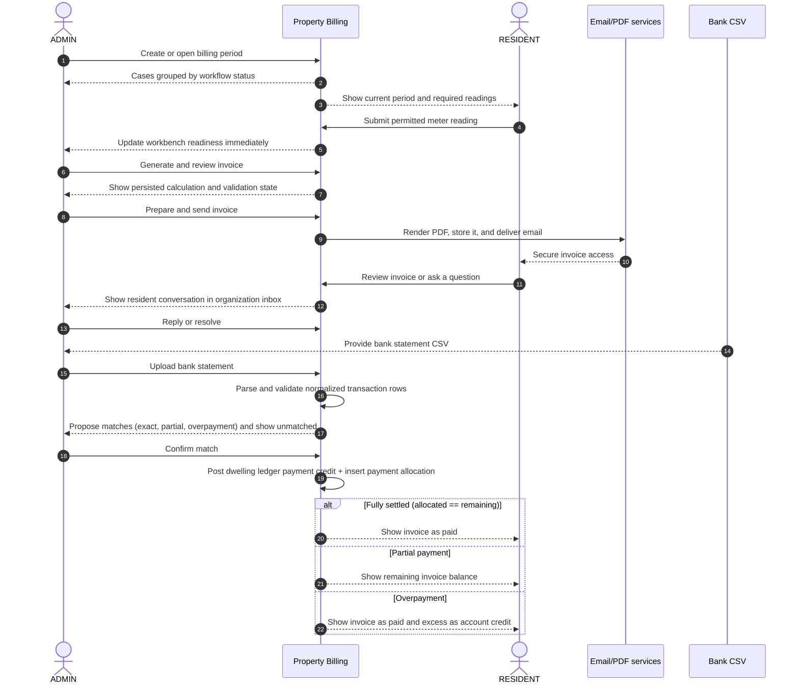

# Property Billing service design blueprint

This blueprint maps the existing v1 monthly billing service across ADMIN and RESIDENT experiences. It is grounded in the [product specification](./ORCA_PROPERTY_BILLING_ASTRO_SPEC.md) and [user journeys](./USER_JOURNEYS.md).

## Service outcome

The service enables an administrator to complete an auditable monthly billing cycle while residents can securely provide required readings, understand their invoices, and ask for help.

```text
collect data → calculate → verify → deliver → reconcile → preserve history
```

## Actors and service boundaries

| Actor or system | Responsibility |
|---|---|
| ADMIN | Manages organization data, periods, readings, invoices, delivery, reconciliation, messages, and settings |
| RESIDENT | Views assigned dwellings, submits permitted readings, reviews invoices and consumption, and sends messages |
| Property Billing frontend | Presents authorized, role-specific tasks and operational state |
| Property Billing domain layer | Enforces billing rules, state transitions, validation, idempotency, and audit behavior |
| PostgreSQL | Preserves tenant-scoped operational and financial records |
| Supabase Auth | Authenticates ADMIN and RESIDENT identities |
| Supabase Storage | Stores canonical invoice PDFs privately |
| Cloudflare Browser Rendering | Produces canonical invoice PDFs from persisted snapshots |
| Amazon SES or local SMTP | Delivers invoice email and local development mail |
| Bank CSV | Provides transactions for payment reconciliation |

The line of visibility sits between the UI and server-side domain operations. Users see outcomes and actionable errors; they do not see credentials, authorization queries, private storage keys, token hashes, or provider internals.

## End-to-end monthly billing blueprint

| Service phase | 1. Access and orient | 2. Open billing period | 3. Collect readings | 4. Generate and verify | 5. Prepare and deliver | 6. Reconcile payment | 7. Preserve and support |
|---|---|---|---|---|---|---|---|
| User goal | Enter the correct role and organization or dwelling | Establish the month being billed | Complete the data required for calculation | Confirm that charges and recipient details are correct | Deliver an immutable invoice | Match incoming money against remaining invoice balances, allocating funds and managing credits | Understand history and resolve questions |
| ADMIN actions | Sign in; choose organization; scan dashboard | Create or select a period; inspect status and dates | Review missing-data cases; open the readings drawer from the workbench row; enter or correct readings | Generate eligible invoices (Missing data resolved or Ready); review lines, totals, issuer, recipient, and payment details; fix blockers via the billing details drawer | Prepare; send according to the dwelling's email/paper preference; inspect delivery result; resend when allowed | Import statement; preview; confirm import; review proposed matches (exact, partial, overpayment) and unmatched transactions; confirm match | Review dwelling (overview/balance/meters/residents/messages/history panels), period, invoice, message, and audit history; reply or resolve; post manual adjustments |
| RESIDENT actions | Request email link; confirm sign-in; select dwelling when needed | View the current period on the dwelling dashboard | Submit a missing reading before the deadline, or review the submitted value and source | Review current invoice amount, status, due date, and calculation lines | Open invoice from portal or secure email link when email delivery is enabled; download or print PDF | Review paid, sent, or overdue status, remaining balance, and account credit; contact administrator when reconciliation appears incorrect | Review invoice and consumption history; create or reply to a conversation |
| Frontstage UI | Role-specific login; organization selector; automatic one-dwelling redirect; simple dwelling selector | ADMIN period history and workbench; RESIDENT current-period context | Attention list; status badges including Ready to invoice; readings drawer with per-meter fields and live consumption; submitted-reading state; deadline or lock explanation | Workbench eligibility; invoice document; billing details drawer surfacing blockers inline, with an escape hatch to the full dwelling page | Prepare/Send actions; email/paper delivery badges; delivery state; email link; document-language selector (Latvian canonical, English/Russian translated copies) on admin, resident, and public views; PDF download with inline SEPA QR; RESIDENT has no ADMIN controls | Payment status tabs; proposed (classified as exact, partial, or overpayment with allocation amount and remaining balance), confirmed, rejected, and unmatched views; import history | Dwelling detail with filterable panels (overview, balance with journal table, meters, residents, messages, history); invoice history; message thread; audit log; empty and resolved states |
| Backstage service actions | Verify Supabase session; load application role; resolve organization membership or dwelling access | Validate dates and uniqueness; create one billing case for each active dwelling; determine missing data | Validate period, meter, access, deadline, cumulative value, and source; calculate exact consumption; update case readiness (Missing data → Ready) in the same transaction; record audit event | Lock case where required; select effective rules; calculate with exact decimals; snapshot issuer, recipient, payment, and rule data (including the dwelling's delivery preference); allocate invoice number; persist invoice and lines transactionally | Validate normal state transition and required snapshots; render and hash PDF; store privately; create access token and deliver email when enabled; record paper delivery as sent when enabled; persist delivery; update case state once at least one method succeeds | Hash and validate file; retain normalized rows; propose matches against remaining invoice balance; lock match, transaction, and invoice; post dwelling ledger payment credit; insert payment allocation; set PAID only if fully settled; audit | Serve scoped historical records; preserve sent invoice data and canonical PDF; retain dwelling ledger entries, conversations, and audit records |
| Supporting systems | Supabase Auth; application authorization tables; secure session cookies | PostgreSQL; Drizzle transactions; organization timezone and locale settings | PostgreSQL numeric values; billing cases; meter history; audit log | Billing rules; Decimal helpers; invoice-number sequence; PostgreSQL transactions; dwelling ledger | Cloudflare Browser Rendering (canonical Latvian PDF, stored once; English/Russian copies rendered on demand, never stored); Supabase Storage; token hashing; SES or SMTP; SEPA QR payload generation; versioned invoice-label dictionary | CSV parser; duplicate file hash constraint; matching algorithm; PostgreSQL transaction; append-only ledger triggers | PostgreSQL; private Storage; audit data; localization and locale-aware formatting |
| User-visible evidence | Authenticated shell; organization or dwelling name; active navigation; account identity | Period label; date range; OPEN or LOCKED badge; created period in history | Missing-reading reason; submitted value; source; consumption; case status moving to Ready to invoice; success or validation message | Invoice number; line items; VAT; total; DRAFT or validation status | PREPARED, SENT, or failed state; delivery record per method; email; canonical PDF | Import filename and row count; proposal status (exact, partial, overpayment); confirmed match; allocation amount; remaining invoice balance; account credit; PAID status | Historical invoice, dwelling account activity row, consumption row, message thread, resolution state, audit entry |
| Key rules and controls | Exactly ADMIN and RESIDENT; server-side authorization; no cross-tenant or cross-resident disclosure | One period per organization and month; locked periods remain viewable but block normal edits | Assigned dwelling only for RESIDENT; open and permitted period; one reading per meter and period; exact decimals; case status is Missing data, Ready, or later only while readiness allows it | Missing data blocks generation; generation is idempotent; totals reconcile; only DRAFT can prepare | Required issuer, recipient, bank, and email data; a dwelling must have email, paper, or both delivery methods enabled; only PREPARED normally sends; sent invoice and PDF are immutable | Matching evaluates remaining unpaid balance; confirmation credits dwelling ledger and allocates to invoice; invoice marked PAID only if fully settled; partial leaves open balance; overpayment leaves account credit; append-only history | Historical financial records and ledger entries remain reproducible; archived dwellings keep history; resolved conversations cannot be manipulated across access boundaries |
| Failure or exception | Invalid credentials; expired link; unprovisioned account; rate limit; insufficient role or access | Invalid dates; duplicate period; no active dwellings; requested period not found | Missing reading; invalid decimal; lower cumulative reading; deadline passed; archived meter; locked period | Missing required data; unsupported manual input; calculation validation; locked period; stale draft snapshot | Missing recipient, issuer, or bank details; no delivery method enabled; PDF failure; email provider failure; repeat send | Invalid headers or rows; duplicate file; ambiguous reference; rejected proposal; concurrent confirmation | Empty history; revoked or expired token; archived entity; resolved conversation; unauthorized resource identifier |
| Recovery shown to user | Retry credentials; request a new link; wait after rate limit; contact administrator | Correct dates; open the existing period; use the empty-state action | Correct the value; ADMIN confirms a legitimate reset; contact administrator after deadline; inspect locked data | Add readings; correct dwelling or organization details via the billing details drawer or full dwelling page; regenerate the draft to refresh snapshots | Correct required data or enable a delivery method; prepare again where allowed; retry or resend after a failed email delivery | Correct the file; inspect row errors before confirmation; leave transaction unmatched; reject an incorrect proposal; post compensating adjustment | Return to scoped history; request a new email link; start a new conversation for a new issue |

## Critical cross-role handoffs



### Handoff requirements

| Handoff | Required service behavior | Success evidence |
|---|---|---|
| ADMIN period → RESIDENT reading task | Only assigned dwellings and permitted meters are exposed | Resident sees the current period and relevant meter state |
| RESIDENT reading → ADMIN workbench | Reading and case readiness update in the same transaction | Missing-data reason disappears or changes immediately |
| ADMIN invoice → RESIDENT invoice | Financial content comes from the persisted invoice snapshot | ADMIN and RESIDENT see the same lines and totals |
| ADMIN send → email access | Successful delivery follows the dwelling's email/paper preference; email delivery creates one scoped token and delivery record, paper delivery records SENT immediately | Resident receives a secure link when email is enabled; ADMIN sees SENT for either method |
| RESIDENT question → ADMIN response | Conversation stays scoped to its dwelling and organization | Both roles see the same thread and resolution state |
| Bank import → resident payment state | ADMIN explicitly confirms the proposal transactionally | Dwelling ledger receives payment credit, allocation records portion applied, invoice transitions to PAID only if fully settled (otherwise updates remaining balance or leaves credit) |

## Frontstage experience principles

### ADMIN

- Dashboard supports monitoring and prioritization.
- Monthly workbench supports execution.
- Contextual drawers resolve common blockers (missing readings, incomplete billing details) in place, without leaving the workbench or losing its filter, search, and scroll state.
- Missing data and overdue cases appear before routine states; a case that becomes fully ready shows as Ready to invoice before it is generated.
- Every unavailable financial action explains its eligibility or blocker.
- Tables retain useful density, natural dwelling order, explicit row navigation, and secondary destructive actions.
- Dwelling detail organizes into filterable panels (overview, balance, meters, residents, messages, history) rather than one long page.
- Organization context remains visible throughout the admin area.

### RESIDENT

- The portal opens directly to the only assigned dwelling when there is one.
- The current invoice and reading task receive the strongest emphasis.
- A completed or paid state reduces action emphasis.
- Submitted readings remain visible with their value and source.
- ADMIN controls and organization-wide information never appear.
- The experience remains usable at mobile width without exposing unsupported payment features.

## Failure prevention and recovery blueprint

| Risk | Prevention | Detection | Recovery | Owner |
|---|---|---|---|---|
| Cross-tenant or cross-resident access | Server-side membership and dwelling-access checks on every protected route and mutation | Integration tests using known foreign UUIDs | Generic denial or not-found response without resource disclosure | Application authorization layer |
| Incorrect invoice calculation | Exact decimals, effective-rule selection, transactional generation, snapshot persistence | Total reconciliation and billing tests | Correct inputs and regenerate while DRAFT | ADMIN and billing domain |
| Invoice prepared with incomplete identity or bank data | Preparation validation against persisted snapshots | Inline blocker above invoice | Correct settings or dwelling details, then regenerate | ADMIN |
| Duplicate invoice generation | Unique constraints and idempotent generation | Existing invoice returned or conflict handled | Continue with existing draft | Billing domain |
| Duplicate invoice delivery | Idempotent first-send command and persisted delivery state | Delivery record and current case state | Use explicit Resend only when allowed | Delivery domain and ADMIN |
| Dwelling has no invoice delivery method enabled | Database check constraint requires email, paper, or both | Validation error on the dwelling's invoice delivery settings | Enable at least one delivery method before sending | Organization ADMIN |
| Resident submits invalid reading | Field validation, access checks, period/deadline checks, cumulative-value rule | Inline validation error | Correct value or contact ADMIN; ADMIN may confirm reset | RESIDENT or ADMIN |
| Duplicate bank import | Organization-scoped file hash constraint and preview | Duplicate warning before confirmation | Choose another statement file | ADMIN and payment domain |
| Incorrect payment match | Candidate matching against remaining unpaid balance (`amountDue - allocated`), explicit result classification (`EXACT`, `PARTIAL`, `OVERPAYMENT`), and explicit ADMIN confirmation | Proposed status remains separate from confirmed | Reject proposal, reject match, or post manual adjustment | ADMIN |
| Provider or PDF failure | Delivery state changes only after successful operations | Failed delivery record and visible error | Correct configuration or retry delivery | Operations and ADMIN |
| Historical financial mutation | Sent invoice, lines, snapshot, canonical PDF, and financial account history (`account_entries`, `payment_allocations`, `late_fee_adjustments`) are protected by append-only database triggers | Integration test and audit history | Correct through compensating manual adjustments or credit carry-forward entries | Billing domain |

## Operational ownership

| Service area | Primary operational owner | Supporting capability |
|---|---|---|
| Identity and access | Application operator and organization ADMIN | Supabase Auth and application authorization |
| Organization and dwelling data | Organization ADMIN | Scoped PostgreSQL records and audit log |
| Meter readings | RESIDENT or organization ADMIN | Period, meter, and validation rules |
| Billing calculation | Property Billing domain service | Effective rules, exact-decimal helpers, and account balance resolution |
| Invoice template configuration | Organization ADMIN | Structured template editor with mandatory/optional block distinction, tariff-synced live preview, block reordering, LV/EN/RU text translation, and template snapshotting |
| Invoice approval | Organization ADMIN | Snapshot validation, ledger debit posting, and workflow state machine |
| PDF and email delivery | Property Billing delivery service | Browser Rendering, private Storage, SES or SMTP |
| Payment reconciliation | Organization ADMIN | Bank CSV import, remaining-balance matching, payment allocation, and dwelling ledger accounting |
| Resident support | Organization ADMIN | Scoped conversations and messages |
| History and audit | Property Billing platform | PostgreSQL, Storage, audit records, and append-only financial ledger |

## Service quality signals

These signals can be calculated from data already supported by the product. They are blueprint measures, not new dashboard requirements.

| Service objective | Existing signal | Healthy interpretation |
|---|---|---|
| Billing data becomes complete | Billing cases by `MISSING_DATA` and `READY` status | Missing-data count falls and Ready count rises before generation |
| Work progresses through the month | Cases by READY, DRAFT, PREPARED, SENT, OVERDUE, and PAID | Cases advance without unexplained reversals |
| Delivery is reliable | Invoice delivery success and failure records | Each intended first send has one successful delivery |
| Reconciliation is efficient | Proposed, confirmed, rejected, and unmatched counts | Confirmed matches increase while unresolved exceptions remain visible |
| Resident input succeeds | Reading source and submitted timestamp | Required RESIDENT readings arrive before the deadline |
| Support closes the loop | Conversation status and update time | New and open conversations progress to resolved |
| History remains trustworthy | Audit events, stable invoice/PDF snapshots, and append-only ledger entries | Sent financial data, PDF hashes, and account ledger rows remain unchanged |

## Blueprint scope boundary

The blueprint does not add card payments, payment gateways (e.g. Stripe, PayU), live automated bank feed synchronization (Open Banking / AISP), automated direct bank refunds, arbitrary multi-invoice manual splits, double-entry general ledger ERP exports, arbitrary freeform document layout or WYSIWYG canvas editors beyond the supported structured invoice template editor, maintenance workflows, extra user roles, or other out-of-scope services. Those would require separate product and service design work before implementation.
