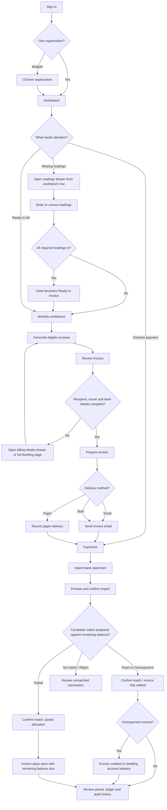
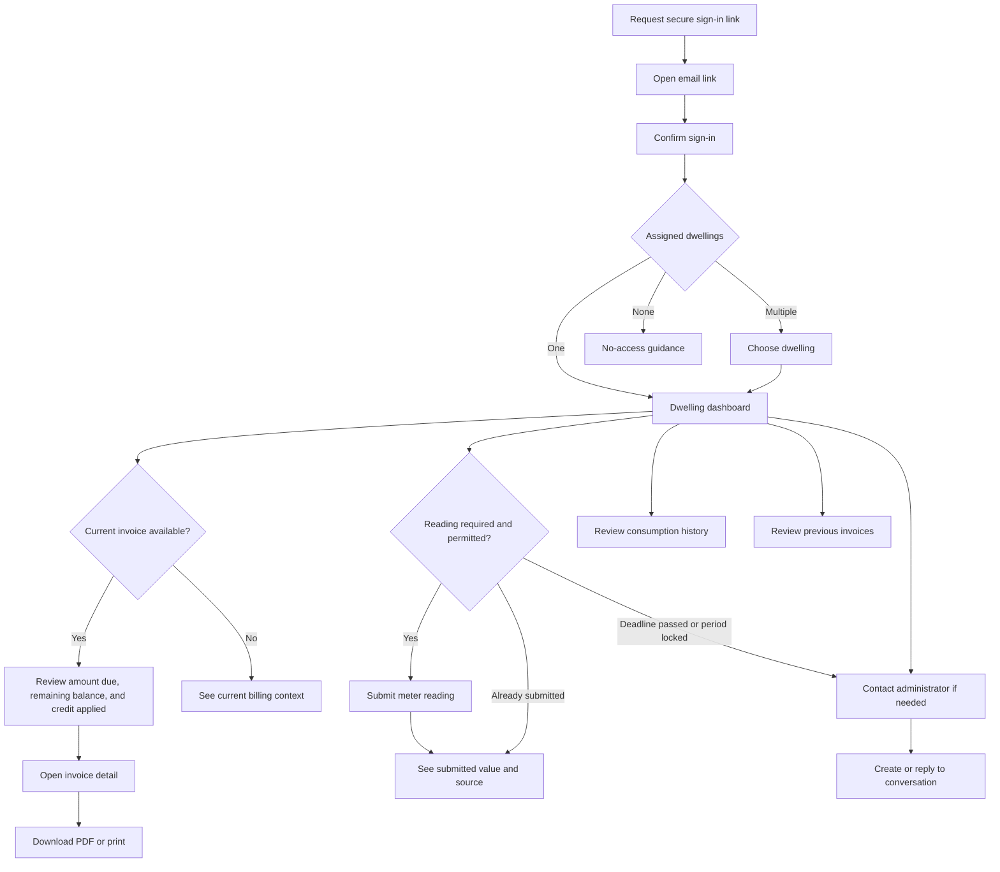

# Property Billing user journeys

These journeys describe the existing v1 product. They preserve the current roles, routes, permissions, and billing lifecycle.

## Admin journey

### Primary goal

Complete the monthly billing cycle accurately: collect readings, create and approve invoices, deliver them, reconcile payments, and preserve the history.

### Journey stages

| Stage | Admin question | Main screen | Primary action | Important states |
|---|---|---|---|---|
| Sign in | Can I access my organization? | `/login` | Sign in | Incorrect credentials, rate limited, MFA policy |
| Select context | Which building am I managing? | `/admin/organizations` | Open organization | One or multiple organizations |
| Monitor | What needs attention now? | `/admin/o/:orgId/dashboard` | Open workbench or resolve attention item | Missing data, overdue, open/locked period |
| Start period | Which month am I billing? | `/admin/o/:orgId/periods` | Create or open period | Open, locked, duplicate month |
| Collect data | Which dwellings lack readings? | `/admin/o/:orgId/periods/:periodId` (readings drawer, opened per row) | Enter readings | Missing, submitted, invalid, ready, period locked |
| Generate | Which cases are eligible? | Monthly workbench | Generate invoice | Eligible (missing data resolved or ready), blocked by missing data, locked |
| Verify | Is the financial document correct? | Admin invoice detail, or billing details drawer for quick recipient fixes | Prepare invoice | Draft, incomplete recipient/issuer/payment data; preparing posts charges to dwelling ledger |
| Deliver | Is the invoice ready to send? | Admin invoice detail | Send invoice | Prepared, sent, delivery failed, resend, paper delivery recorded |
| Reconcile | Which incoming payments match? | `/admin/o/:orgId/payments` | Confirm proposed match | Proposed (Exact, Partial, Overpayment), confirmed, rejected, unmatched |
| Investigate | What happened for this dwelling or invoice? | Dwelling detail (overview/balance/meters/residents/messages/history panels), invoice, message, and audit views | Review or correct supported data | Archived dwelling, immutable sent invoice, dwelling ledger activity, manual adjustments |
| Configure | Are billing and organization defaults correct? | `/admin/o/:orgId/settings`, dwelling invoice-delivery checkboxes | Save settings | Validation errors, automation enabled/disabled, at least one delivery method required |

### Admin recovery paths

- Missing reading: open the readings drawer directly from the workbench row and record the reading; the case moves from Missing data to Ready to invoice automatically once every required reading is in, with no page navigation.
- Invalid reading: correct the value; a lower cumulative value requires explicit admin confirmation.
- Prepare blocked: open the billing details drawer from the workbench (or the full dwelling page) to correct recipient details, or fix organization bank/legal details in settings, then regenerate the draft so its snapshot is refreshed.
- Send blocked: add the billing email, then send the prepared invoice.
- No delivery method selected: a dwelling must have email, paper, or both enabled before its invoices can be delivered; enable at least one in the dwelling's invoice delivery settings.
- Delivery failed: review the failure and retry with Resend when permitted.
- Partial payment received: confirm the proposed match; the incoming transaction is fully recorded in the dwelling account ledger, an allocation is posted to the invoice, and the invoice remains open with an updated remaining unpaid balance (`amountDue - allocated`). A subsequent payment can be matched to settle the remaining balance.
- Overpayment received: confirm the proposed match; the full amount is posted to the dwelling account ledger, the invoice is fully settled and marked `PAID`, and the excess amount sits as dwelling account credit (`accountBalance < 0`) which automatically offsets future invoice statements.
- Dwelling balance discrepancy: inspect the dwelling balance panel and account ledger entries. Post a manual adjustment (`CHARGE` or `CREDIT`) with an administrative reason to adjust the balance without mutating historical invoices.
- Late-fee disputes: review the applied late fee on a prepared invoice; adjust the fee via manual late-fee adjustment before sending the invoice.
- Unmatched payment: keep it in the unmatched queue for manual review or reject candidate proposals; do not confirm an allocation without a verified match.
- Locked period: inspect historical data; normal reading edits and invoice regeneration remain unavailable.
- Sent invoice error: preserve the immutable invoice and its ledger debit; correct the discrepancy via compensating manual adjustments or future period statements.

## Resident journey

### Primary goal

Understand the current bill, provide allowed meter readings, review consumption and invoice history, and contact the administrator when help is needed.

### Journey stages

| Stage | Resident question | Main screen | Primary action | Important states |
|---|---|---|---|---|
| Sign in | How do I access my billing information? | `/login` | Request sign-in link | Neutral response, expired link, rate limited |
| Confirm | Is this sign-in request mine? | `/auth/confirm` | Confirm sign-in | Valid, expired, already used |
| Select dwelling | Which dwelling do I want to view? | `/portal/dwellings` | Open dwelling | Automatic redirect for one dwelling, selector for multiple |
| Understand current bill | What do I owe and when? | `/portal/dwellings/:dwellingId` | Review invoice | No invoice, sent, partially paid (remaining balance due), fully paid, overdue; shows previous debt or credit carried forward; portal stays fully available even when the dwelling receives paper (not email) delivery |
| Submit readings | Does the administrator need a reading? | Dwelling dashboard | Submit reading | Missing, received, deadline passed, period locked |
| Review invoice | How was this total calculated? | `/portal/invoices/:invoiceId` | Download PDF or print | Lines, VAT, total, payment details |
| Review history | What was billed previously? | `/portal/dwellings/:dwellingId/invoices` | Open invoice | Empty history, paid, sent, overdue |
| Understand usage | How has consumption changed? | Dwelling dashboard | Review history | Cold/hot water values or no history |
| Get help | I have a billing question | `/portal/dwellings/:dwellingId/messages` | Send message or reply | New, open, resolved conversation |
| Manage session | Which account and dwellings can I access? | `/portal/profile` | Review access or sign out | One or multiple dwelling assignments |

### Resident recovery paths

- Sign-in link expired: request a new link from the login page.
- No dwelling access: contact the administrator; the portal does not reveal other dwellings.
- Reading rejected: correct the decimal value or contact the administrator if it is lower than the previous reading.
- Reading deadline passed: view the existing state and message the administrator.
- No current invoice: continue to view readings, consumption, messages, and available invoice history.
- Invoice overdue or partially paid: review remaining unpaid balance, previous carried balance, and credit applied; contact administrator if payment reconciliation or account credit appears incorrect.
- Resolved conversation: start a new conversation when a new issue arises.

## Experience distinction

| Admin | Resident |
|---|---|
| Persistent operational navigation | Small task-oriented navigation |
| Monitors the whole organization | Sees assigned dwellings only |
| Executes billing workflow transitions | Reads invoices and submits permitted data |
| Reconciles bank transactions | Does not make payments in the product |
| Handles exceptions and configuration | Receives clear state and next-step guidance |
| Desktop-efficient, information-dense | Mobile-first, focused and concise |
